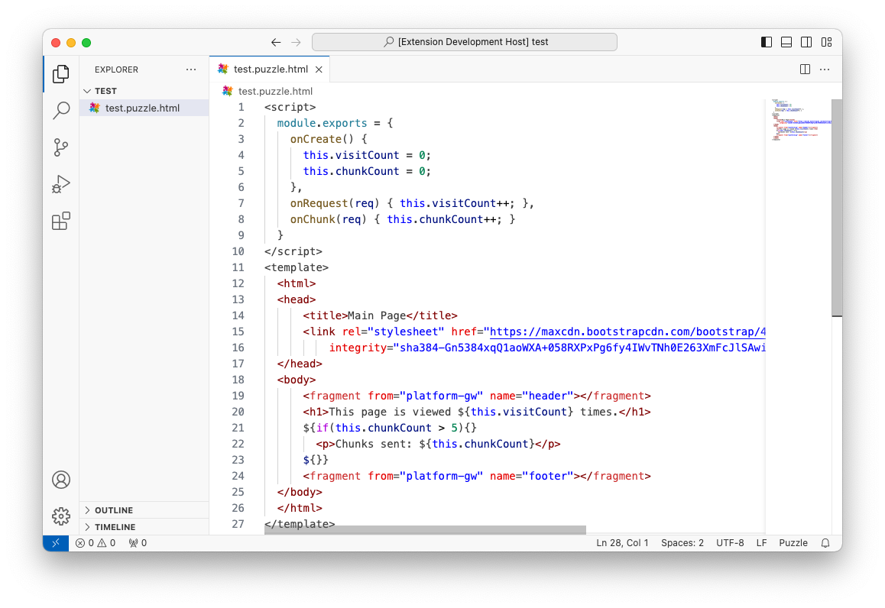

# VSCode Extension for PuzzleJs Framework

This extension provides support for the [PuzzleJs](https://github.com/puzzle-js/puzzle-js) framework.

## Features

- Syntax highlighting
- File icon support

### Snippets

- `fragment`: Adds a new fragment tag.
- `js`: Starts a js injection inside HTML template.
- `if`: Starts an if block inside HTML template.

## Known Issues

No issues currently. Please open an issue if you face any.

## Release Notes

Users appreciate release notes as you update your extension.

### 1.0.0

Initial release of Puzzle Framework extension.
- Syntax support
- File icons

### 1.2.0

New puzzle template snippets has been added.

---

## Contributors

- [@yunusemredilber](https://github.com/yunusemredilber) Yunus - creator
